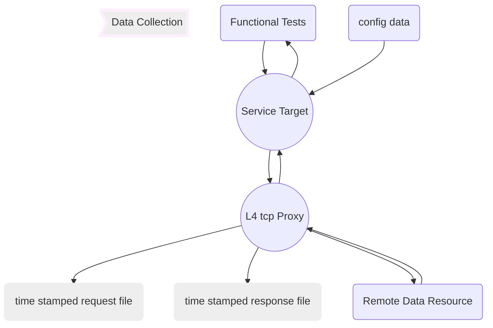
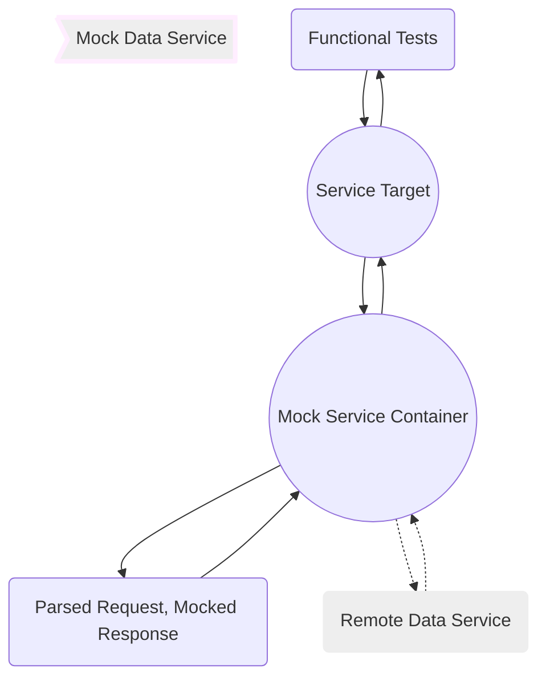

# Mock Data Service

## Overview

Mock Data Services are designed to intercept, record and play-back standard request/response patterns, whether REST or SOAP.  The L4 proxy listens for connections, stores incoming requests then sends the request to the remote target and stores the target's response.  Stored responses can then be used to short-circuit the full round trip to the target by returning qualified responses to recognized requests.

### Mock Data Collection

The first step in creating mock data is to collect it from the source.  The L4 Proxy is designed to be placed in between the services being tested and thier dependant remote data resources.  Request and response data is written to separate files that shared a time-stamped file name.

### Mock Data Request/Response

With data collected from the first process, requests are indexed and responses are _templated_ to provide well-formed responses to test requests.  Mock data and logic is stored in containers to enable packaging data service-by-service. 

Real requests and responses continue to be gathered in the background and compared to mock responses to insure that downstream data changes are captured when they occur.

---

###### darryl.west | 2018.03.18

