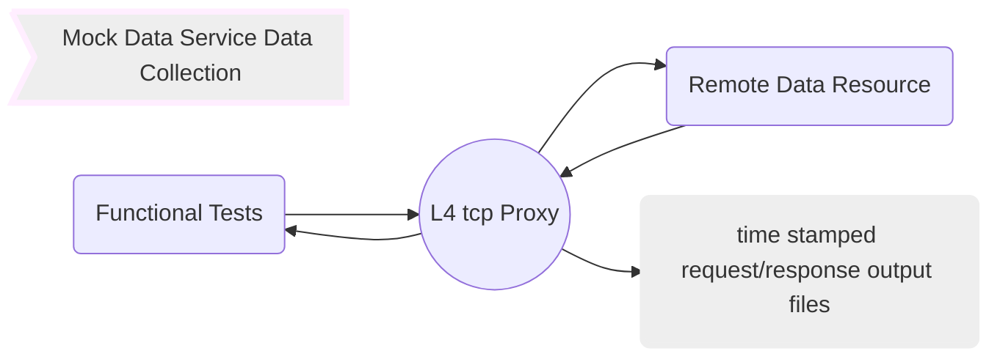
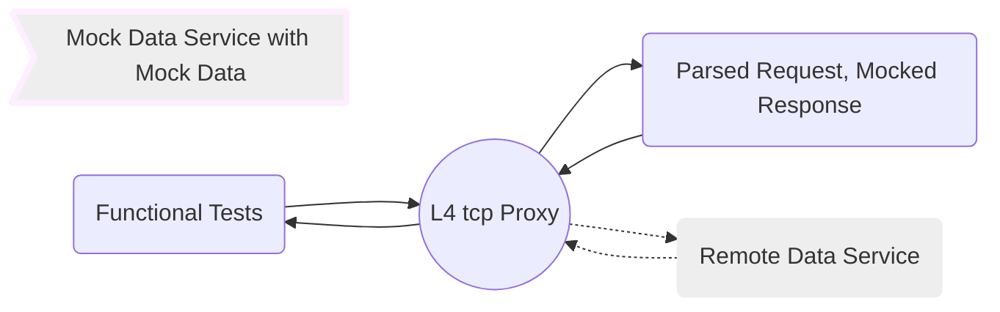

# Mock Data Service

## Overview

### Mock Data Collection

```mermaid
graph LR
id1>Mock Data Service Data Collection]
style id1 fill:#eee,stroke:#fef,stroke-width:4px
A(Functional Tests) --> B((L4 tcp Proxy)) 
B --> A
B --> C(Remote Data Resource)
C --> B;
B --> D(time stamped request/response output files)
style D fill:#eee,stroke:#eee,stroke-width:4px
```

### Mock Data Request/Response

```mermaid
graph LR
id1>Mock Data Service with Mock Data]
style id1 fill:#eee,stroke:#fef,stroke-width:4px
A(Functional Tests) --> B((L4 tcp Proxy)) 
B --> A
B --> C(Parsed Request, Mocked Response)
C --> B
B .-> D(Remote Data Service)
D .-> B
style D fill:#eee,stroke:#eee
```

---

###### darryl.west | 2018.03.18
